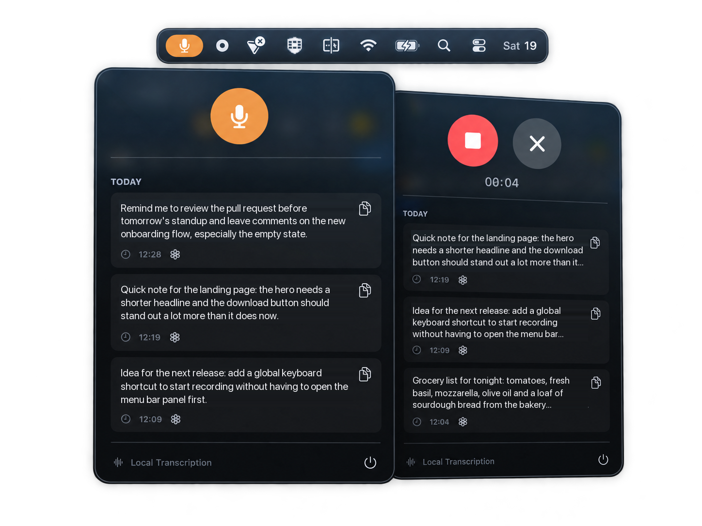

<div align="center">

# wh_

**Local voice-to-text for macOS.**

Fast. Private. WhisperKit-powered. Open source.

[](#requirements)
[](https://swift.org)
[](https://github.com/argmaxinc/WhisperKit)
[](#privacy)
[](LICENSE)

<br />



<br />

*Lives in your menu bar. Simple and powerful.*

<br />

[**Download for macOS**](https://github.com/MaxCavalheiro/wh_/releases/latest) · [**Build from source**](#build-from-source) · [**Report a bug**](https://github.com/MaxCavalheiro/wh_/issues)

</div>

---

## Features

<table>
  <tr>
    <td align="center" width="25%">
      <h3>🔒</h3>
      <b>Local &amp; Private</b><br />
      <sub>Your voice never leaves your Mac. No accounts, no servers, no telemetry.</sub>
    </td>
    <td align="center" width="25%">
      <h3>⚡️</h3>
      <b>WhisperKit Powered</b><br />
      <sub>State-of-the-art Whisper models running on Apple Silicon via Core ML.</sub>
    </td>
    <td align="center" width="25%">
      <h3>🎙️</h3>
      <b>Menu Bar Workflow</b><br />
      <sub>Always at hand, never in the way. One click to record, one to transcribe.</sub>
    </td>
    <td align="center" width="25%">
      <h3>🌍</h3>
      <b>Open Source</b><br />
      <sub>Transparent, community driven, MIT licensed.</sub>
    </td>
  </tr>
</table>

- **Transcription history** — every transcription is saved locally (SwiftData) and grouped by day.
- **Copy in one click** — send any past transcription straight to your clipboard.
- **Open in ChatGPT** — copy a transcription, open ChatGPT in your browser and paste it into the composer. It never hits *Send* for you.
- **Auto model selection** — WhisperKit picks the best model for your machine on first launch and caches it for next time.

## Get started

**In three simple steps.**

| 1 · Download | 2 · Install | 3 · Start dictating |
| :-- | :-- | :-- |
| Get the `.dmg` from the [latest release](https://github.com/MaxCavalheiro/wh_/releases/latest). | Open it and drag `wh.app` to *Applications*. | Click the microphone icon in the menu bar and speak. |

> **First launch:** macOS will say wh_ "cannot be opened because Apple cannot check it
> for malicious software". wh_ is not signed with an Apple Developer certificate (the
> program costs $99/year), so Gatekeeper cannot verify it. To open it anyway:
>
> 1. Open **System Settings › Privacy & Security**.
> 2. Scroll down to the message about wh_ and click **Open Anyway**.
> 3. Confirm with **Open**.
>
> You only do this once. If you would rather not, [build from source](#build-from-source) —
> apps you compile yourself are trusted automatically.

> On first launch wh_ downloads a Whisper model (a few hundred MB) into the app's sandbox container (`~/Library/Containers/max.wh/Data/Library/Application Support/WhisperModels`). This happens once; after that everything runs offline.

## Usage

**Turn speech into text.**

| 1 · Record | 2 · Transcribe | 3 · Copy or send |
| :-- | :-- | :-- |
| Click the menu bar icon and press the orange mic button. | Press stop. wh_ transcribes locally using WhisperKit. | Copy the text, or open it in ChatGPT with one click. |

### Permissions

| Permission | Why | Required? |
| :-- | :-- | :-- |
| **Microphone** | Recording your voice. | Yes |
| **Accessibility** | Only used to paste (⌘V) into ChatGPT's composer after opening it in your browser. | Optional — without it the text is still copied to your clipboard. |

## Build from source

Clone the repository and build with Xcode or from the command line.

```sh
git clone https://github.com/MaxCavalheiro/wh_.git
cd wh_
open wh.xcodeproj
```

Or straight from the terminal:

```sh
xcodebuild -scheme wh -configuration Release build
```

Run the test suite:

```sh
xcodebuild -scheme wh -destination 'platform=macOS' test
```

Build a release DMG (universal, Apple Silicon and Intel) into `dist/`:

```sh
scripts/build-release.sh
```

> Integration tests (`WhisperIntegrationTests`, `AudioRecorderIntegrationTests`) download a model and need a microphone, so they take a while the first time.

### Requirements

- macOS 14 Sonoma or later
- Xcode 16 or later
- Apple Silicon recommended (Intel Macs work, but transcription is noticeably slower)

### Configuration

Model selection and storage paths live in [`wh/App/AppConfiguration.swift`](wh/App/AppConfiguration.swift). Set `whisperModel` to e.g. `"openai_whisper-base"` for a smaller, faster model.

## Privacy

wh_ is **local-first by design**:

- Audio is recorded to a temporary file, transcribed on-device and deleted.
- Transcriptions are stored only in a local SwiftData database inside the app's sandbox container.
- The only network access is downloading the Whisper model from Hugging Face on first launch — and opening ChatGPT in your browser *if you ask for it*.
- The app runs inside the macOS App Sandbox.

## Project structure

```
wh/
├── App/            Entry point and configuration
├── Features/       SwiftUI views and view models (menu bar panel)
├── Models/         Transcription entries and history sections
├── Services/       Audio recording, WhisperKit, clipboard, history, ChatGPT launcher
└── Utilities/      Logging, errors, formatting, theme
whTests/            Unit tests, integration tests and mocks
```

Built with SwiftUI, SwiftData, AVFoundation and [WhisperKit](https://github.com/argmaxinc/WhisperKit).

## Contributing

**Contributions are welcome.**

Found a bug? Have an idea? [Open an issue](https://github.com/MaxCavalheiro/wh_/issues) or submit a pull request. Let's make wh_ better, together.

1. Fork the repo and create a branch from `main`.
2. Make your change and add tests where it makes sense.
3. Make sure `xcodebuild test` passes.
4. Open a pull request describing what changed and why.

## License

[MIT](LICENSE) © Max Cavalheiro

This project follows the [Contributor Covenant](CODE_OF_CONDUCT.md) code of conduct.
